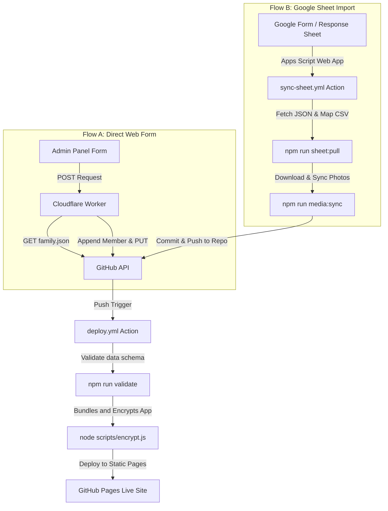

# 🌳 Running & Manually Testing The Family Tree

This guide provides step-by-step instructions to run the application locally and perform comprehensive manual testing to verify its features.

---

## 🚀 Part 1: How to Run the Application

The Family Tree is a **zero-cost, static HTML web application**. It runs entirely in the browser and requires no backend database. However, it uses local JS modules, which require a local web server to avoid CORS issues when loading data files.

### 📋 Prerequisites
* **Node.js** (v18.0.0 or higher recommended)
* **Python 3** (optional, used by the cache-busting development server)

---

### 🔧 Setup Steps

1. **Install Dependencies**
   In your terminal, navigate to the project directory and install the developer dependencies (used for data validation and encryption):
   ```bash
   npm install
   ```

2. **Validate the Family Data**
   Before running, ensure that the family tree structure and configuration are valid:
   ```bash
   npm run validate
   ```
   *Alternative CLI command:* `node scripts/validate.js`

3. **Start the Development Server**
   Run the included development server script:
   ```bash
   ./dev-server.sh
   ```
   * **What this does:** It launches a custom Python-based HTTP server on port `8000` that injects headers to **disable browser caching** (`Cache-Control: no-cache`). This ensures that edits to `family.json` or frontend JS files are reflected immediately.
   * **Auto-Open:** The script will ask if you want to open the browser automatically. Type `y` (or press Enter) to open `http://localhost:8000`.

4. **Alternative Web Server (If Python is not installed)**
   If you do not have Python, you can use any static file server:
   ```bash
   npx http-server -p 8000 -c-1
   ```
   Then manually open `http://localhost:8000` in your web browser.

---

## 🧪 Part 2: Manual Testing Checklist

Follow this checklist to manually test the core features of the application.

### 🔑 1. Authentication & Sign-in Flow
* [ ] **Family Password Gate**
  * Type an incorrect password and click **Continue**. Verify that an alert error is shown.
  * Enter the correct family password: `InLovingMemoryOfJyoti=Energy` and click **Continue**. Verify it smoothly transitions to the Name & DOB step.
* [ ] **Identity Hash Verification**
  * Input a random name/DOB (e.g., "John Doe", "01/01/2000") and click **Continue**. Verify it shows an identity verification failure.
  * Input the correct credentials for **Hitesh Sathawane** (Admin):
    * **Full Name:** `Hitesh Sathawane`
    * **Date of Birth:** `29/12/1985` *(Note: DOB matches the auth hash config)*
  * Click **Continue**. Verify that the login form hides, the body gets the `logged-in` class, and the visual tree canvas appears.
* [ ] **Session & Logout**
  * Verify the **ME chip** in the top bar displays "Hitesh" and a thumbnail "H".
  * Click the **Logout** button. Verify that the application reloads and prompts you for the family password again.

---

### 🗺️ 2. Visual Tree Canvas Navigation
* [ ] **Pan & Drag**
  * Left-click and hold on a blank area of the canvas, then move the mouse. Verify that the tree pans smoothly.
* [ ] **Zoom controls**
  * Scroll the mouse wheel up/down over the canvas. Verify it zooms in and out.
  * Click the `+` (Zoom In) and `-` (Zoom Out) buttons in the bottom-left controls.
  * Click the **Fit Tree** button (square icon). Verify the canvas zooms and pans to fit all family member nodes on the screen.
  * Click the **Center on me** button (target icon). Verify the viewport centers on your logged-in member card.
* [ ] **Minimap Interactive Sync**
  * Verify the minimap is visible in the bottom-right corner.
  * Pan the main canvas and verify that the red viewport box on the minimap updates its position in real-time.

---

### 🔍 3. Search & Quick Filters
* [ ] **Fuzzy Search**
  * Click the search bar at the top (`Search by name...`).
  * Type `shankar`. Verify that "Shankar Sathawane" appears in the dropdown list.
  * Type a relationship label like `wife` or `son`. Verify that the search engine matches relevant relations.
  * Click the `✕` button inside the search input. Verify that the search input clears and the dropdown closes.
* [ ] **Keyboard Navigation**
  * Type a name in the search bar, use the `ArrowDown` and `ArrowUp` keys to highlight entries, and press `Enter`.
  * Verify the application pans to the selected person and highlights their path from you.
* [ ] **Tag Filters**
  * Click one of the filter tags (e.g., a specific branch or tag) in the top-chrome row.
  * Verify that matching nodes are highlighted while non-matching nodes and connecting lines are dimmed.
  * Verify the status pill at the top displays the active filter and match count.
  * Click the `✕` on the status pill or click the tag again to clear the filter.

---

### 🕸️ 4. Relationship Paths & Sidebar Lightbox
* [ ] **Path Highlighting**
  * Click on any relative's card (e.g., "Swati Sathawane").
  * Verify that a colored path highlights the connection lines from you ("Me") to them.
  * Verify that the top status pill shows the relationship breadcrumbs (e.g., `Me → Wife`).
  * Click on a blank area of the canvas. Verify that the path highlight is cleared.
* [ ] **Detail Lightbox**
  * Click on a member's card to open the slide-in detail lightbox.
  * Verify that it shows:
    * Full name and life dates (birth/death or current age).
    * Calculated relationship text (e.g., "Father", "Mother", "Wife").
    * Profile biography text.
    * Clickable quick relations chips (parents, siblings, children). Click a chip and verify that the lightbox updates to that person and the canvas pans to them.
    * Photo scrapbook/timeline section (if media is associated).
  * Click the `✕` close button or click outside the lightbox sheet to close it.

---

### 🌐 5. Internationalization (i18n) & Local Layouts
* [ ] **Language Toggle**
  * Click the **EN** button in the top bar. Verify it switches to **मराठी** and the member card names and titles update to Marathi (e.g., "हितेश साठवणे", "शंकर साठवणे").
  * Click it again to switch back to English.
  * Reload the page. Verify your language preference is persisted via `localStorage`.
* [ ] **Mobile Viewport Responsive Test**
  * Open browser Developer Tools (F12) and toggle device emulation to a mobile screen (e.g., width `375px` or `414px`).
  * Verify that:
    * The bottom navigation bar appears (Tree, Search, Timeline, Profile).
    * Node cards adjust to a compact sizing.
    * The lightbox sheet expands to full-screen.
    * Swiping navigation works smoothly.

---

### 📡 6. Offline Support (PWA)
* [ ] **Service Worker Offline Testing**
  * In browser DevTools, go to the **Network** tab and tick the **Offline** checkbox (or disconnect your internet).
  * Reload the page.
  * Verify that the application shell, layout, styling, and family tree assets still load and function perfectly offline.

---

## 🛠️ Part 3: CLI Development Tools

For advanced testing and configuration, you can use these command-line scripts:

* **Generate Login Hashes:**
  To add or update login credentials for a member in `data/auth.json`:
  ```bash
  node scripts/setup-auth.js "Member Name" "DDMMYYYY" --role [viewer|contributor|admin]
  ```
  *(This will output the JSON entry and attempt to append it to `data/auth.json`)*

* **Reset Tree / Clear All Data:**
  To start from scratch and remove all current family members:
  ```bash
  npm run clear:data
  ```
  *Alternative syntax to customize the seeded Admin account:*
  ```bash
  node scripts/clear-data.js "Your Name" "DDMMYYYY"
  ```
  *(This automatically creates a backup of your old `family.json` and `auth.json` in the `backups/` folder, resets the dataset, and seeds a single Admin member with the provided login credentials)*
  
* **CSV Bulk Import:**
  To test bulk import functionality locally:
  ```bash
  node scripts/csv-import.js data/sample-import.csv
  node scripts/validate.js
  ```

---

## 🔄 Part 4: Testing Data Synchronization & GitHub Actions

The application supports two distinct pipelines to keep your family tree synchronized. Below is how you can test each flow and understand the underlying automation called by GitHub Actions.

### 🗺️ Data Synchronization Pipelines



---

### 1. Flow A: Direct Web Form Sync (via Cloudflare Worker)
This pipeline allows non-technical family members to add details directly using the **Add Member** form inside the Admin Panel.

#### How to Test:
1. **Prerequisite**: Set up a Cloudflare Worker using the code in `worker/index.js` and set the `GITHUB_TOKEN` secret in Cloudflare.
2. In [data/config.json](file:///Users/hiteshsathawane/Library/CloudStorage/OneDrive-Personal/Developement/TheFamilyTreeProject/data/config.json#L47), populate `"workerUrl"` with your deployed Cloudflare Worker's URL.
3. Open your browser to the local application, log in as an Admin, and navigate to the **Add Member** form.
4. Fill in the member details and submit the form.
5. Check your GitHub repository's **commit history**. You should see a new commit from the worker API: `Add new member: [First Name] [Last Name]`.
6. Open your repository's **Actions** tab on GitHub. You should see the **Validate, Encrypt & Deploy** workflow running automatically.

#### GitHub Actions Workflow Called (`deploy.yml`):
When the Cloudflare Worker pushes a commit to the `main` branch, GitHub Actions executes these steps:
* Checks out the repository code.
* Installs dependencies via `npm ci`.
* Runs `npm run validate` to verify the new person matches the database schema.
* If valid, runs `node scripts/encrypt.js` to bundle the fresh `family.json` and `auth.json` into `index.html` and encrypt it using the repository secret `FAMILY_PASSWORD`.
* Uploads the encrypted `dist/` directory and publishes it to **GitHub Pages**.

---

### 2. Flow B: Google Sheets Sync Pipeline
This pipeline pulls responses from a Google Sheet (usually populated by a Google Form) and merges them into the local repository database.

#### How to Test:
1. Set the following environment variables in your local `.env` file (never commit this file):
   * `GOOGLE_SHEET_URL`: The deployed Google Apps Script Web App URL.
   * `GOOGLE_SHEET_SECRET`: The secure API token matching your Apps Script configuration.
2. Fill out your Google Form with new test member entries.
3. In your local terminal, run the sync command manually:
   ```bash
   npm run sheet:pull
   ```
4. Verify that:
   - A new CSV is written to `data/form-responses.csv`.
   - The new entries are successfully merged into your local `data/family.json`.
   - Running `npm run validate` passes with no logical errors.

#### GitHub Actions Workflow Called (`sync-sheet.yml`):
In a production deployment, this sync is triggered either manually or via a webhook (`repository_dispatch` trigger). When called, it runs:
* **Checkout & Install**: Clones the repo and installs dependencies.
* **Pull & Sync**: Runs `npm run sheet:pull` (fetch and merge data) followed by `npm run media:sync` (syncs Google Drive image URLs to Cloudflare R2).
* **Commit**: Commits and pushes any modifications to `data/family.json`, `data/auth.json`, and `data/form-responses.csv` back to the GitHub repository.
* **Redeploy Trigger**: Pushing these changes automatically kicks off the **Validate, Encrypt & Deploy** (`deploy.yml`) action to rebuild the live site.

---

## 🎨 Part 5: Testing & Debugging the Family Tree Layout Engine

To achieve a clean canvas layout (using vertical/horizontal space efficiently and minimizing cross-connections like the one shown in your mock diagram), you need to test the **Dynamic Client-Side Layout Engine** which runs in [tree-helpers.js](file:///Users/hiteshsathawane/Library/CloudStorage/OneDrive-Personal/Developement/TheFamilyTreeProject/tree-helpers.js).

### 1. Step 1: Restore the original Multi-Generational Data
Since you cleared the tree data to start from scratch, you first need to restore your multi-generational backup data to test the layout of Hitesh, Swati, Shankar, Jyoti, Chaaya, and Bhimrao:
1. Locate the backup folder in `backups/before_clear_[TIMESTAMP]` (e.g. `backups/before_clear_2026-06-20T02-43-17-190Z`).
2. Restore the files:
   ```bash
   cp backups/before_clear_YOUR_TIMESTAMP/family.json data/family.json
   cp backups/before_clear_YOUR_TIMESTAMP/auth.json data/auth.json
   ```
3. Run `npm run validate` to verify it passes.

---

### 2. Step 2: Set Up the Layout Test Cycle
1. Start the local server: `./dev-server.sh`
2. Open your browser to `http://localhost:8000` and sign in.
3. Keep the browser's **Developer Tools** (F12) console open.
4. Open [tree-helpers.js](file:///Users/hiteshsathawane/Library/CloudStorage/OneDrive-Personal/Developement/TheFamilyTreeProject/tree-helpers.js) in your editor.
5. Every time you make a change to the layout algorithm in `tree-helpers.js`, perform a **Hard Refresh** (`Cmd+Shift+R` on Mac or `Ctrl+F5` on Windows) to bypass the browser cache and render the updated coordinates immediately.

---

### 3. Step 3: Understanding & Debugging the Layout Code
The node and connector layout is calculated inside the function `window.processRawFamilyData` in [tree-helpers.js](file:///Users/hiteshsathawane/Library/CloudStorage/OneDrive-Personal/Developement/TheFamilyTreeProject/tree-helpers.js#L333).

#### 📐 Horizontal & Vertical Spacing Rules
* **Vertical Spacing**: Nodes are organized by generation levels (`lvl`). Their Y coordinate is set by:
  ```javascript
  computedCoords[p.id].y = lvl * 420;
  ```
  *To test vertical spacing*: Increase the multiplier (e.g., `lvl * 500` or `lvl * 600`) in [tree-helpers.js:L693-694](file:///Users/hiteshsathawane/Library/CloudStorage/OneDrive-Personal/Developement/TheFamilyTreeProject/tree-helpers.js#L693-L694) to give connecting lines more vertical height, making the links look cleaner.
* **Horizontal Spacing**: Governing constants are defined at [tree-helpers.js:L597-600](file:///Users/hiteshsathawane/Library/CloudStorage/OneDrive-Personal/Developement/TheFamilyTreeProject/tree-helpers.js#L597-L600):
  ```javascript
  const coupleWidth = 360;       // Horizontal spacing between a married couple
  const singleWidth = 200;       // Horizontal space for a single person card
  const childGap = 100;          // Horizontal gap between siblings
  const inLawExtraPadding = 560; // Padding added when positioning in-law families
  ```
  *To test horizontal spacing*: Adjust these values and hard-refresh to see how compact or wide the tree spans.

---

### 4. Step 4: Resolving Spouse Cross-Connections
The crossing lines shown in your diagram happen when **Husband is on the right but his parents are on the left**, and **Wife is on the left but her parents are on the right**. 

To fix this crossing, the engine has swap logic at [tree-helpers.js:L675-688](file:///Users/hiteshsathawane/Library/CloudStorage/OneDrive-Personal/Developement/TheFamilyTreeProject/tree-helpers.js#L675-L688):
```javascript
let swap = false;
if (hParentX !== null && wParentX !== null) {
  if (hParentX > wParentX) {
    swap = true; // Swap positions so husband is on the right, wife on the left
  }
}
```

#### Why it fails for In-Laws (causing crosses):
Because **in-laws (e.g., Swati's parents, Bhimrao & Chaaya) are recursively laid out *after* the main couple**, `wParentX` (Wife's parents average X) evaluates to `null` during this check. This causes the swap algorithm to skip the checks and default to placing the husband on the left and the wife on the right, creating crossed parent lines.

#### How to fix and test the swap:
1. Print coordinate calculations during render:
   Add this log line inside `assignAbsoluteCoords` right after `wParentX` is calculated in [tree-helpers.js](file:///Users/hiteshsathawane/Library/CloudStorage/OneDrive-Personal/Developement/TheFamilyTreeProject/tree-helpers.js#L673):
   ```javascript
   console.log(`Node: ${husband.firstName} & ${wife.firstName} | hParentX: ${hParentX} | wParentX: ${wParentX} | Swap: ${swap}`);
   ```
2. Refactor the swap condition to look ahead or look at the parent relationship structures directly:
   * Instead of checking `computedCoords` (which might be `null` for in-laws), check the **parent relationships** directly in the tree hierarchy.
   * Put the spouse whose parents are positioned leftward on the left side, and the spouse whose parents are positioned rightward on the right side.
3. Save and refresh the browser. The print lines and visual paths in the SVG lines ([tree-app.js:L115-175](file:///Users/hiteshsathawane/Library/CloudStorage/OneDrive-Personal/Developement/TheFamilyTreeProject/tree-app.js#L115-L175)) will show if the alignment successfully prevents line crossing.
